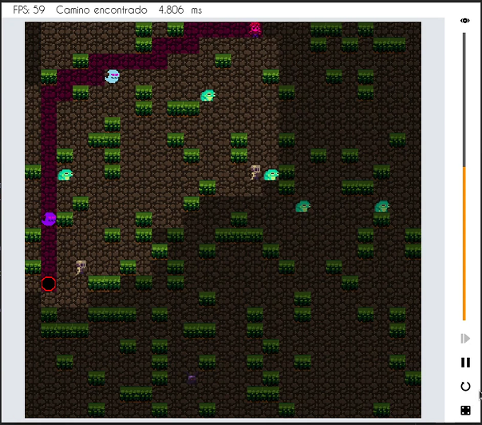

# A* Pathfinder

ULL Project. The player sprite will use A* to find the shortest path to the destination. Monsters have not been implemented and they are only aesthetic. Controls:
 - W, A, S, D: Move camera
 - Scroll: Zoom
 - Mouse click: Remove tile contents
 - Mouse click while pressing key 1: Add wall to tile
 - Mouse click while pressing key 2: Move player sprite
 - Mouse click while pressing key 3: Move treasure sprite
 - Mouse click while pressing key 4,5,6,7: Add monster to tile
 
Menu controls:

 - Top eye button: Track player (currently not working)
 - Vertical bar: Click on any position of the vertical bar to set a simulation speed (0 for step by step)
 - Step by step: Click to run a single step (speed must be 0)
 - Run/Pause: Run/pause simulation (speed must be > 0)
 - Restart
 - Randomize map
 
 
 
 **Check the video, [docs/ia-coche.mp4](docs/ia-coche.mp4) !**
 
## Compilation

Make file should be ready to compile on linux and windows. Allegro 5 must be installed, compilation is made with shared libraries. To install on Linux: 

```
~$ sudo add-apt-repository ppa:allegro/5.2
~$ sudo apt update

# The core library.
~$ sudo apt install liballegro5-dev

# The addons.
~$ sudo apt install liballegro-acodec5-dev liballegro-audio5-dev \
       liballegro-image5-dev liballegro-dialog5-dev liballegro-ttf5-dev \
       liballegro-physfs5-dev

# Check that it is installed with:
~$ pkg-config --list-all | grep allegro
allegro_ttf-5                  allegro_ttf - Allegro game programming library, TrueType fonts addon
allegro_color-5                allegro_color - Allegro game programming library, colors addon
allegro_dialog-5               allegro_dialog - Allegro game programming library, native dialog addon
allegro_video-5                allegro_video - Allegro game programming library, video player addon
allegro_acodec-5               allegro_acodec - Allegro game programming library, audio codec addon
allegro_main-5                 allegro_main - Allegro game programming library, magic main addon
allegro_font-5                 allegro_font - Allegro game programming library, font addon
allegro_memfile-5              allegro_memfile - Allegro game programming library, memory files addon
allegro_image-5                allegro_image - Allegro game programming library, image I/O addon
allegro-5                      allegro - Allegro game programming library
allegro_physfs-5               allegro_physfs - Allegro game programming library, PhysicsFS addon
allegro_primitives-5           allegro_primitives - Allegro game programming library, primitives addon
allegro_audio-5                allegro_audio - Allegro game programming library, audio addon
```